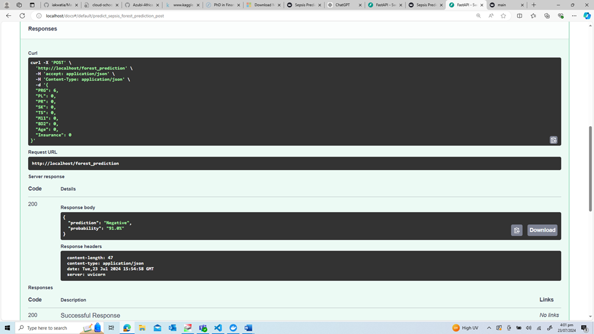

# Machine-Learning-API-using-FastAPI-to-predict-Sepsis
Building an ML model to predict Sepsis and building an API using FastAPI to embed the built ML model

The analysis and machine learning applications of sepsis datasets are critical in advancing medical research and improving patient care outcomes. 
By leveraging these datasets, it will aid in the early detection, diagnosis, and management of sepsis in patients. 
This is crucial because early intervention can significantly improve patient outcomes. This project objective is to build an ML app that will predict sepsis in a patient
based on the features in the data set below

### Data 

The data consists of the following columns:

PRG: Plasma glucose

PL: Blood Work Result-1 (mu U/ml)

PR: Blood Pressure (mm Hg)

SK: Blood Work Result-2 (mm)

TS: Blood Work Result-3 (mu U/ml)

M11: Body mass index (weight in kg/(height in m)^2

BD2: Blood Work Result-4 (mu U/ml)

Age: patients age (years)

Insurance: If a patient holds a valid insurance card

Sepsis: Positive: if a patient in ICU will develop a sepsis , and Negative: otherwi

streamlit app

fastAPI

Docker Container & Image

links
[FastAPI link](https://iakwatia-ike-api.hf.space/docs)

Author

Isaac asante-Kwatia